## Lab 9 -Bartosz Gacek

Uploading models to s3 (later I've switched to uploading zip instead of the directory)
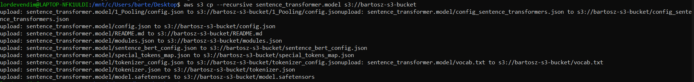

---

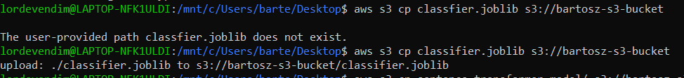

### Docker and ECS

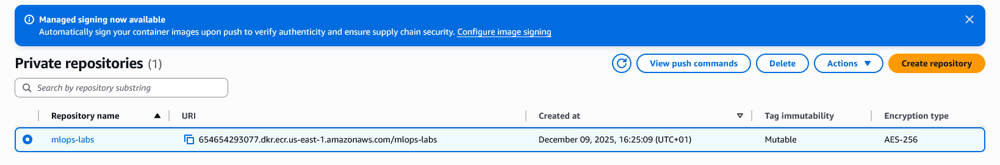

---

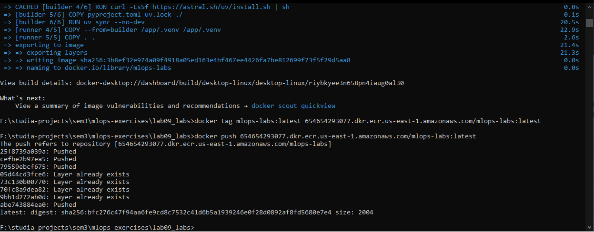

---

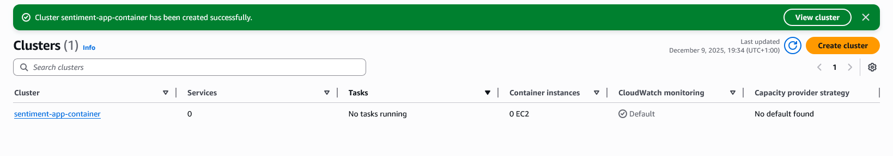

### Load balancer

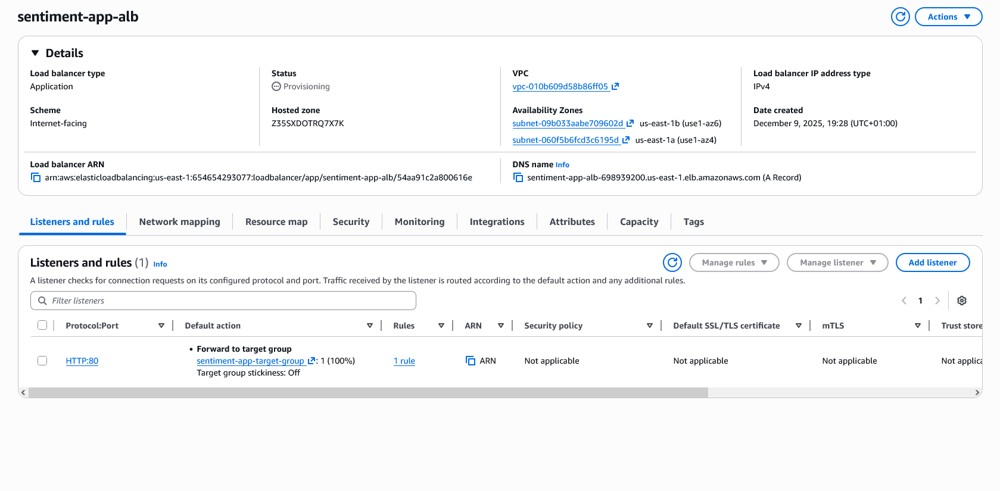

### Routing / Networking

---

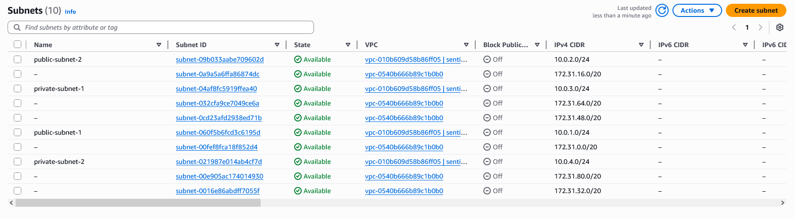

### Security groups

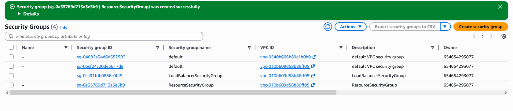

## Service

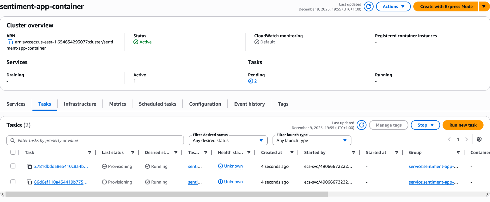

## Final results

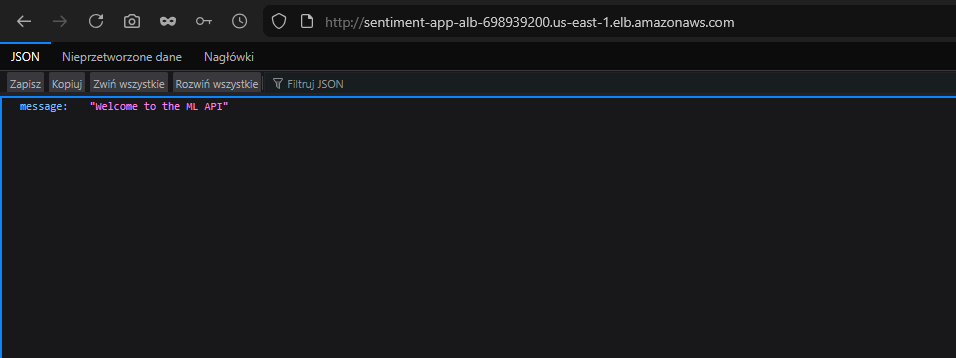

---

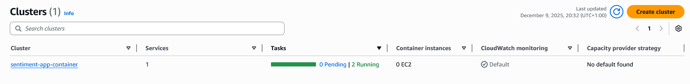

Despite changing the project name in the `pyproject.toml` and resyncing the env name in the console remains to be `lab01-homework`. Probably some caching issues.
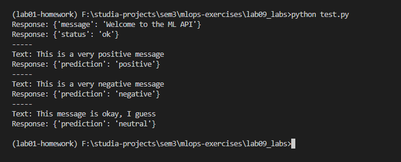
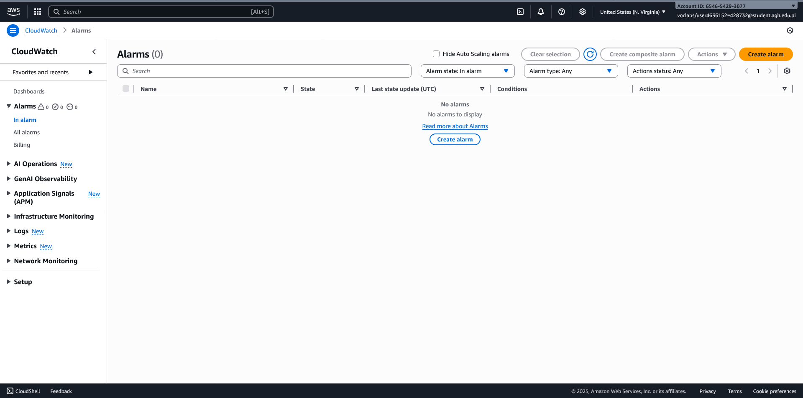
