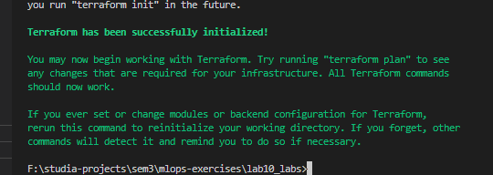
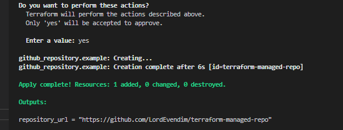
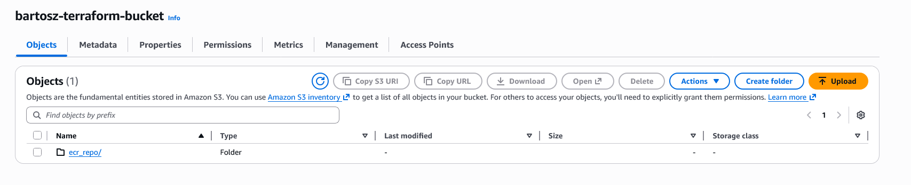
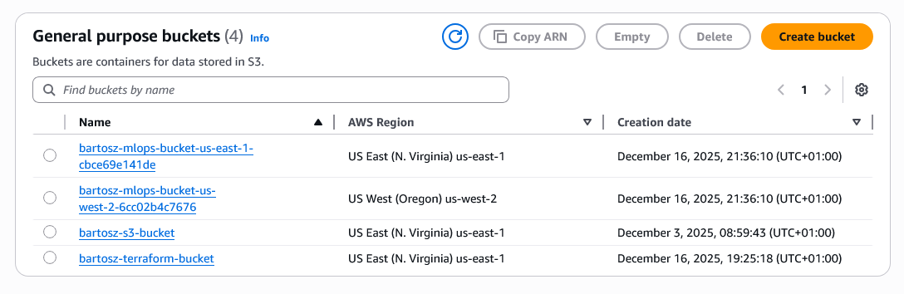

**Now review the changes and determine for yourself whether it is now clearer, shorter and easier to maintain the module.**

Maybe with the higher number of buckets it could make sense, but in our case where we create only 2 simple buckets, I think - despite reduced code duplicaiton - it adds much more overhead than the initial version.
