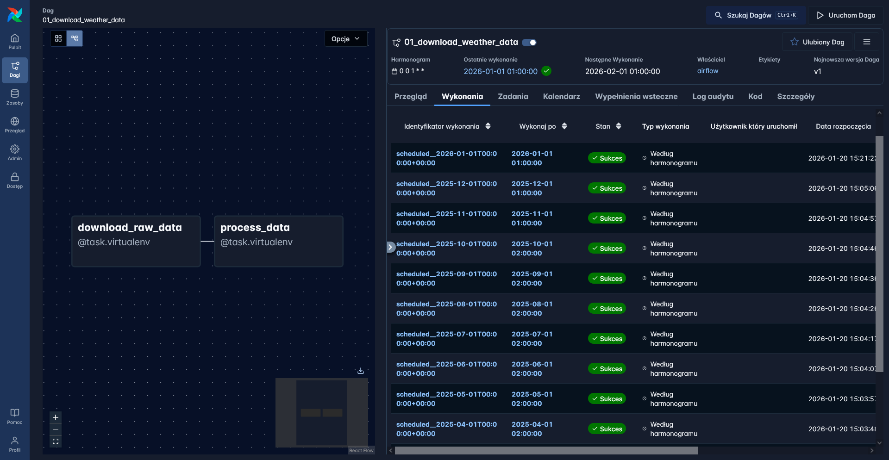
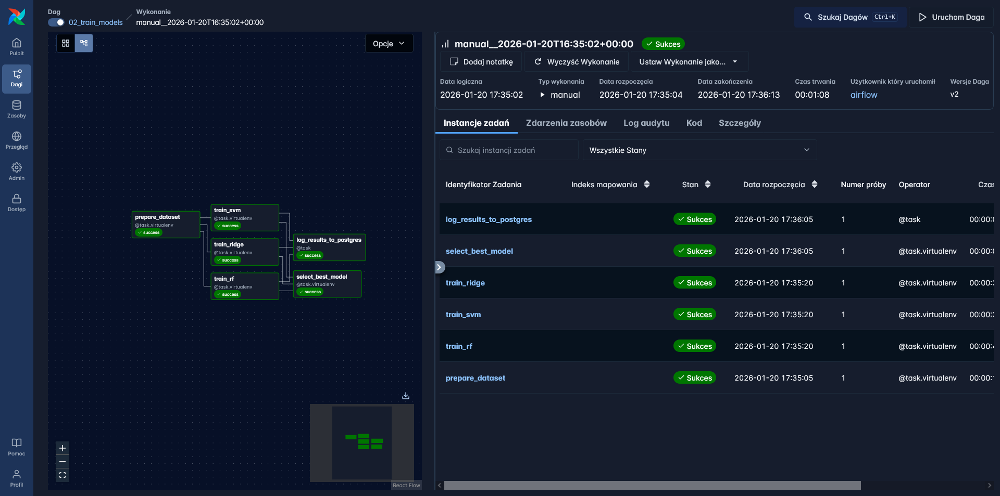
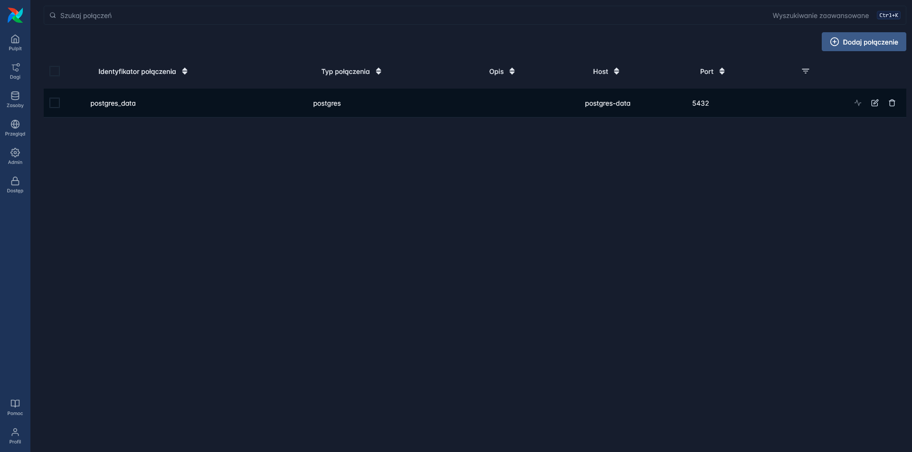
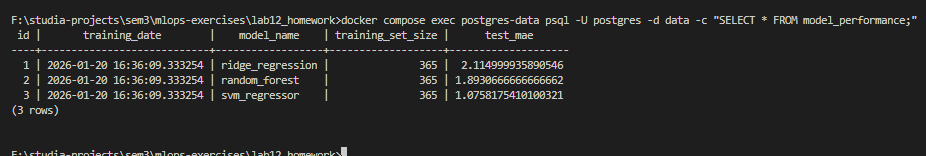
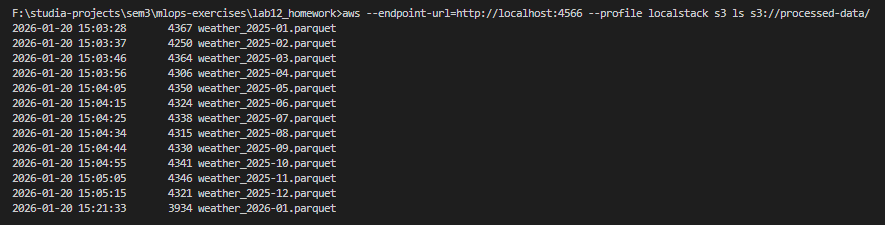
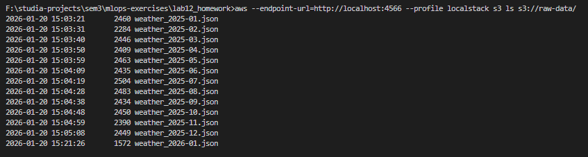

# Screenshots

#### Successful runs on both dags with and their execution graphs

#### Connection for the postgres client

### The resulting data inside postgres-data client's table

#### The resulting files inside two s3 buckets

