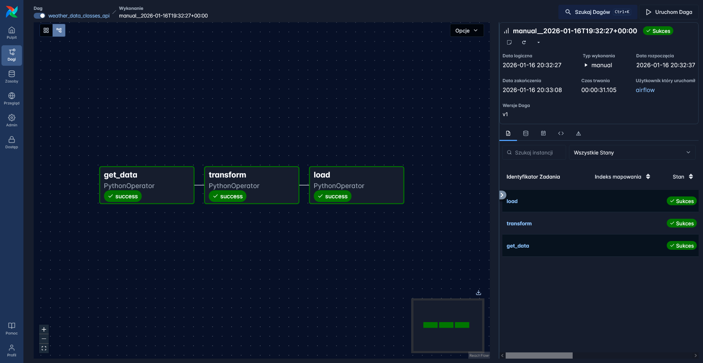
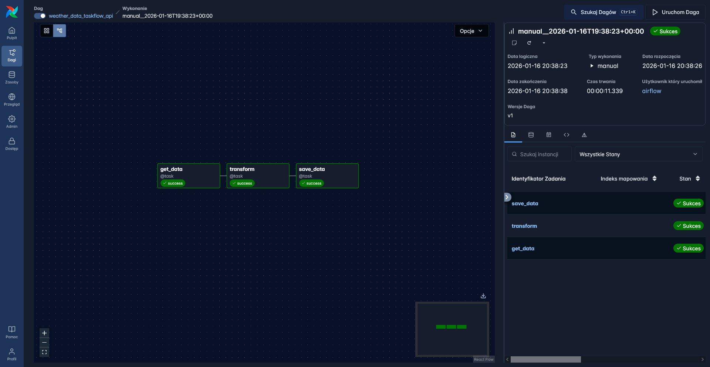
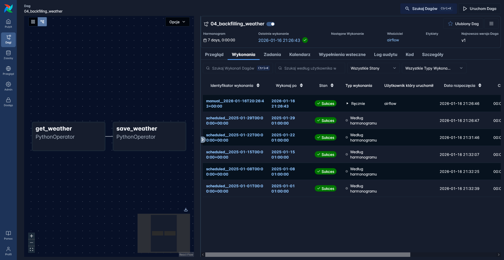
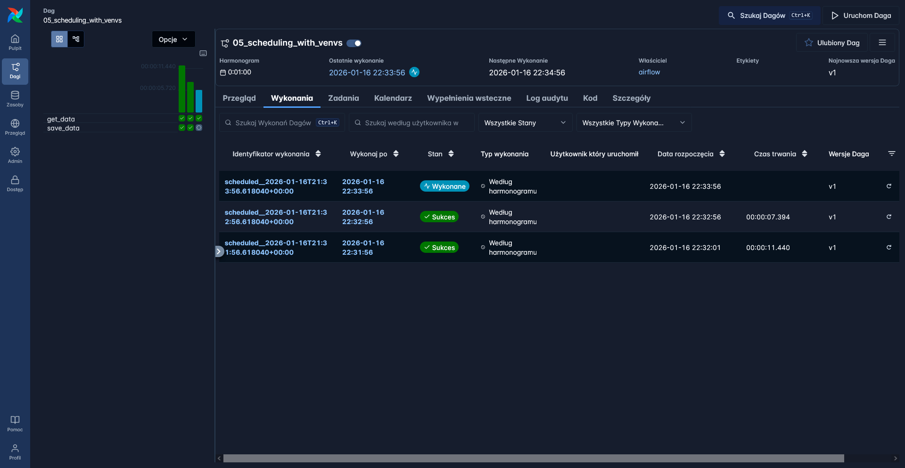
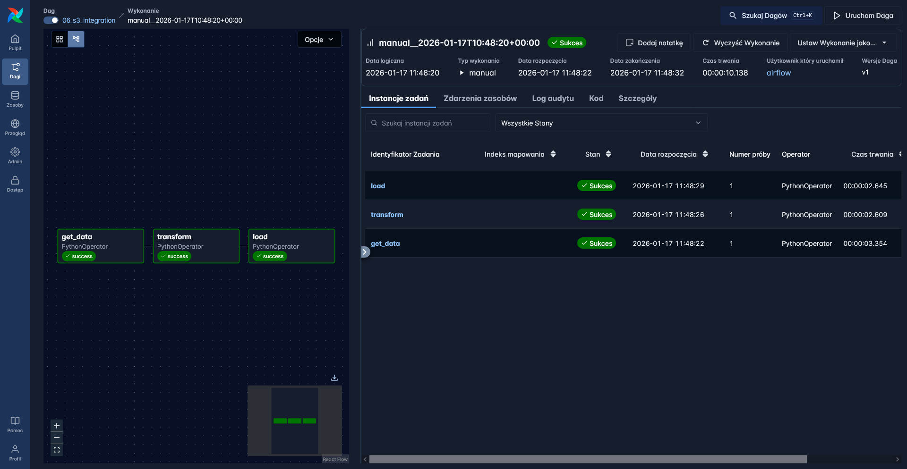
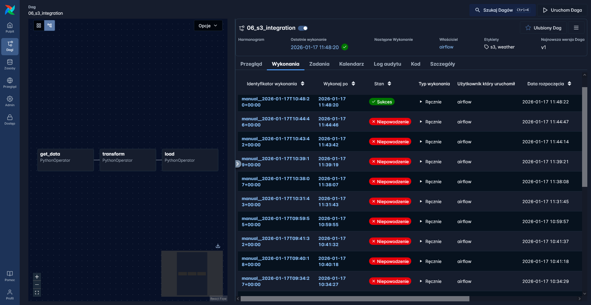
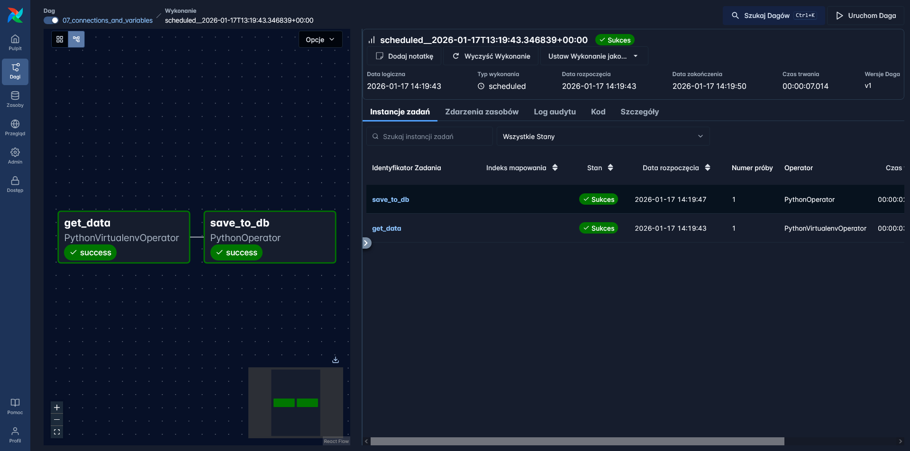

# Screenshots

#### `01_class_pipeline.py` example

#### Exercise 1

#### Exercise 2

#### Exercise 3

#### Exercise 4

Despite using Docker, it seems like the distributed system we are trying to setup is still very unstable. I spent many hours fighting with it: restartting, clearning caches, debugging and etc...

#### Exercise 5

