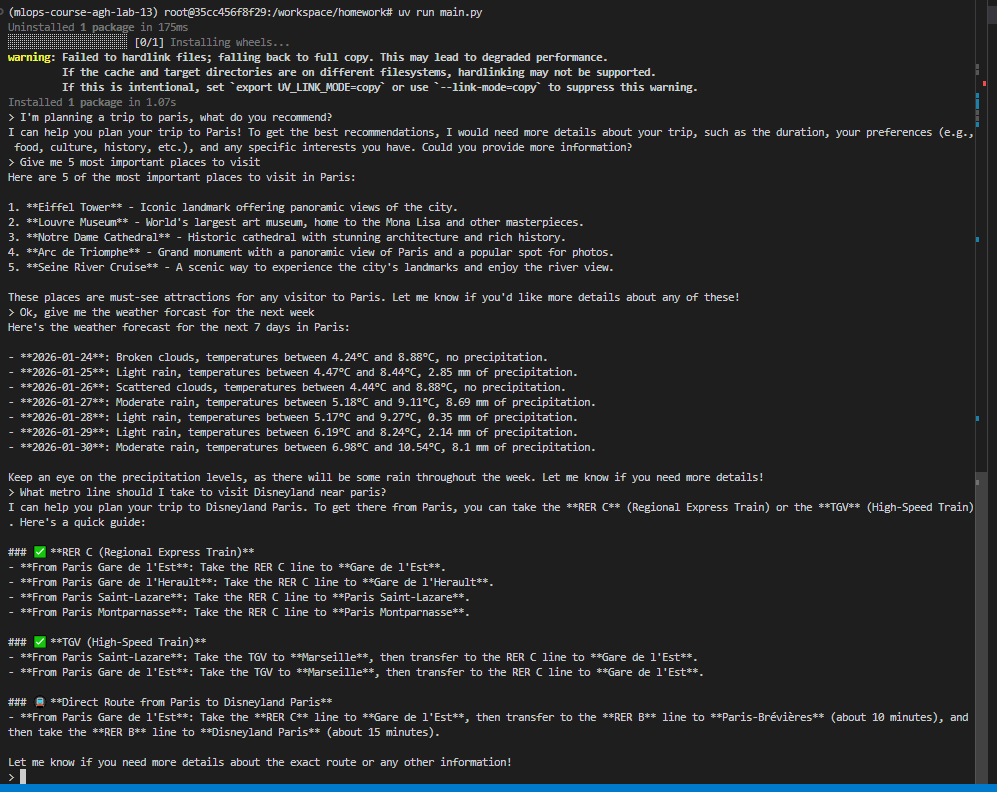
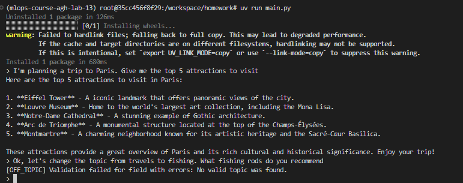

# Lab 13 - homework

I had problems running vllm locally (windows) so I did this homework (and lab) inside a Runpod VM.
There I run into permission issues and could not run the `docker compose`. I included files to run the project with `docker compose`, but I actually started services manually.

Screenshot of the conversation with the agent:

Screenshot of the guardrails activating when trying to switch the topic:

