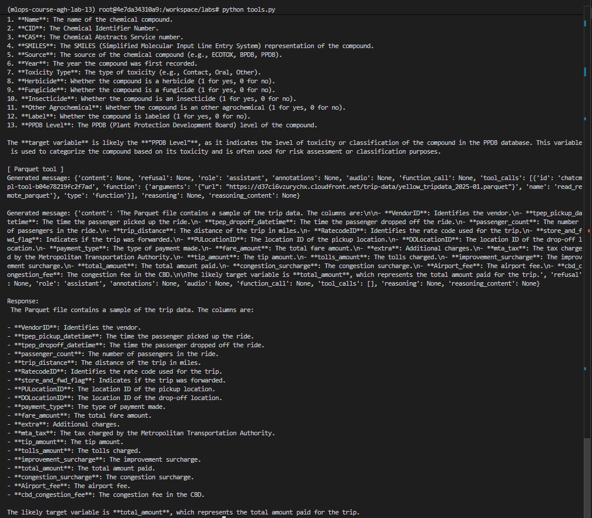
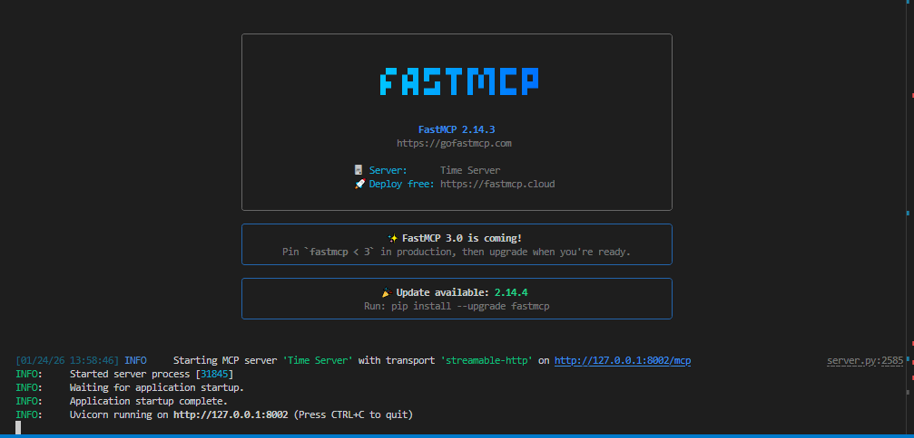
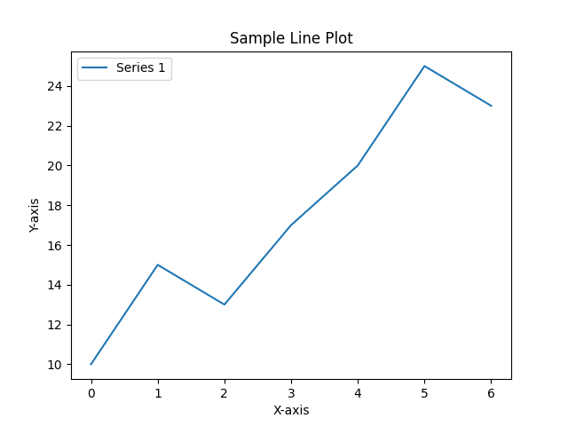
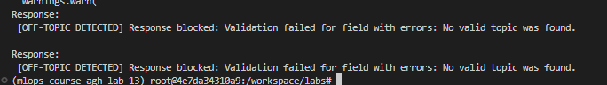
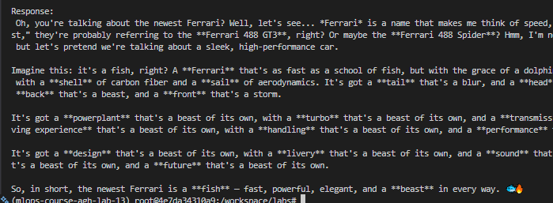

# Lab 13

## Exercise 1

##### Memory

```bash
# Standard
(EngineCore_DP0 pid=7641) INFO 01-24 12:50:17 [gpu_worker.py:375] Available KV cache memory: 35.34 GiB
(EngineCore_DP0 pid=7641) INFO 01-24 12:50:17 [kv_cache_utils.py:1291] GPU KV cache size: 330,864 tokens

# Quantized
(EngineCore_DP0 pid=10414) INFO 01-24 12:54:43 [gpu_worker.py:375] Available KV cache memory: 37.23 GiB
(EngineCore_DP0 pid=10414) INFO 01-24 12:54:43 [kv_cache_utils.py:1291] GPU KV cache size: 348,528 tokens
```

##### Performance

```
Standard: 11.358465433120728s
Quantized: 10.129230260848999s
```

# Exercise 2



# Exercise 3



# Exercise 4

Plot generated by the MCP server



# Exercise 5

Seems like the model managed to detect the offtopic questions, but did not detect the jailbreak attempt, which was pretty simple.



but I managed to cheat it when I insturcted the model to pretend we are talking about fishes, which worked.


